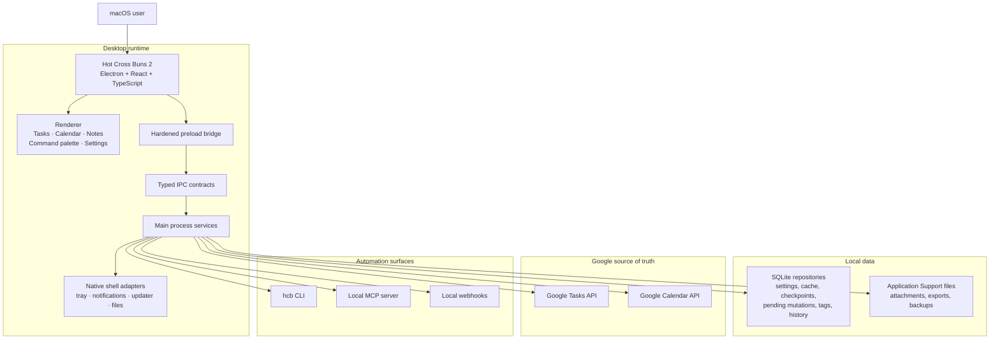

<p align="center">
  <a href="https://github.com/gongahkia/hot-cross-buns-2">
    
  </a>
</p>

<h1 align="center">Hot Cross Buns 2</h1>

<h3 align="center">Keyboard-first macOS client for Google Tasks and Google Calendar with account workspaces, automation and endless customization.</h3>

<p align="center">
  <a href="https://gongahkia.github.io/hot-cross-buns-2/">Website</a> ·
  <a href="docs/README.md">Docs</a> ·
  <a href="docs/mcp.md">MCP</a> ·
  <a href="docs/architecture/system-architecture.md">Architecture</a>
</p>

<p align="center">
  <a href="https://github.com/gongahkia/hot-cross-buns-2/releases/latest/download/Hot-Cross-Buns-2-macOS.dmg">
    
  </a>
</p>

<p align="center">
  <a href="https://github.com/gongahkia/hot-cross-buns-2/releases/latest">
    
  </a>
  
  
</p>

> [!IMPORTANT]
> Preview downloads currently ship as unsigned DMGs. On first launch, macOS may ask the user to allow the app once from `System Settings > Privacy & Security > Open Anyway`.

## Table of Contents

- [Highlights](#highlights)
- [Install](#install)
- [Architecture](#architecture)
- [Repository Layout](#repository-layout)
- [Local Development](#local-development)
- [Preview Release Checks](#preview-release-checks)
- [Testing](#testing)
- [Additional Documentation](#additional-documentation)

## Highlights

Hot Cross Buns 2 is an Electron-first macOS planner built around three everyday surfaces:

- Tasks for inbox capture and day-to-day execution, synced with Google Tasks
- Calendar views for agenda, day, week, multi-day, month, year, and longer-range planning, synced with Google Calendar
- Notes backed by task data for context, drafts, and reference material

Around those core surfaces, the app also includes:

- Command palette capture and keyboard-first navigation
- Account workspaces for multiple Google accounts
- Smart rescheduling, task/event/note conversion, reminders, recurrence, templates, and saved views
- Menu bar surfaces for glanceable calendar, compact capture, and fast return to the main app
- Local customization with CSS snippets, keymaps, extension panels, custom backgrounds, and inferred color themes
- Portable `.hcbexport` archives, local attachments, ICS import/subscription support, and local report exports
- Optional local MCP server, CLI, webhook, and dry-run/write-policy surfaces for user-configured agent clients
- Typed IPC, hardened preload bridge, diagnostics, recovery tools, and native capability reporting

## Install

**Preview downloads**

- DMG: `https://github.com/gongahkia/hot-cross-buns-2/releases/latest/download/Hot-Cross-Buns-2-macOS.dmg`
- Release page: `https://github.com/gongahkia/hot-cross-buns-2/releases/latest`
- One-line installer:

```bash
curl -fsSL https://gongahkia.github.io/hot-cross-buns-2/install-macos-preview.sh | bash
```

**First launch on macOS**

1. Open the app once after dragging it into `Applications`.
2. If macOS blocks it, go to `System Settings > Privacy & Security`.
3. Click `Open Anyway`.

You should only need to do that once per Mac.

**Google Cloud OAuth setup**

Downloaded DMGs use a bring-your-own Google Cloud Desktop OAuth client:

1. Create a Google Cloud project.
2. Enable the Google Tasks API and Google Calendar API.
3. Configure the OAuth consent screen. For personal use, add your Google account as a test user while setting up.
4. Create a `Desktop app` OAuth client.
5. Open Hot Cross Buns 2, paste the desktop client ID and optional client secret into setup, then connect Google.

Do not distribute a build that embeds your personal OAuth client for other people's accounts.

## Architecture



## Repository Layout

```text
src/main/          Electron main process, native adapters, SQLite repositories, services
src/preload/       Narrow preload bridge over typed IPC contracts
src/renderer/      React app shell, planner surfaces, settings, command palette
src/shared/        Shared schemas, contracts, catalogs, sync/search helpers
docs/              Website, product docs, architecture, release, security, QA docs
scripts/           Local CLI, smoke, release, and packaging helpers
```

Start with [docs/README.md](docs/README.md) before changing product, architecture, security, or subsystem behavior.

## Local Development

**Requirements**

- macOS 14+
- Node 20+
- pnpm 9.15.4 through Corepack

**Install and run**

```bash
corepack enable
corepack prepare pnpm@9.15.4 --activate
pnpm install
pnpm dev
```

**Useful commands**

```bash
pnpm typecheck
pnpm test
pnpm test:smoke
pnpm hcb --help
```

## Preview Release Checks

Preview packages are unsigned and unnotarized. They are not final public distribution builds.

```bash
pnpm release:mac:preview
```

Useful docs:

- [Distribution](docs/release/distribution.md)
- [Release Candidate Checklist](docs/release/release-candidate-checklist.md)
- [Mac Preview Support](docs/support/mac-preview-support.md)
- [Privacy and Threat Model](docs/security/privacy-and-threat-model.md)

## Testing

The current suite covers:

- typed IPC contract validation
- SQLite repository and domain-service behavior
- Google Tasks and Google Calendar sync paths
- local search, semantic search, tags, templates, and automation flows
- renderer workflows for Tasks, Calendar, Notes, Settings, command palette, and onboarding
- native shell adapter contracts and release-support paths
- smoke, perf, and release-artifact scripts

Run focused tests with:

```bash
pnpm vitest run --config vitest.config.ts path/to/test.ts
```

## Additional Documentation

- [Docs index](docs/README.md)
- [System architecture](docs/architecture/system-architecture.md)
- [Tech stack](docs/architecture/tech-stack.md)
- [Google sync spec](docs/specs/google-sync.md)
- [Local data spec](docs/specs/local-data.md)
- [MCP agent access](docs/specs/mcp-agent-access.md)
- [Customization](docs/customization/theming.md)
- [Portable export](docs/portable-export.md)
- [QA plan](docs/testing/qa-plan.md)
